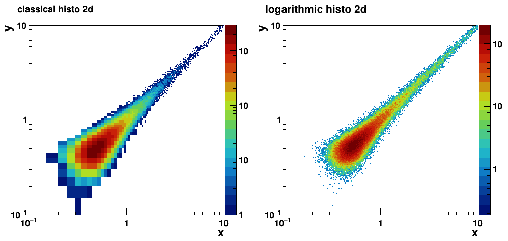
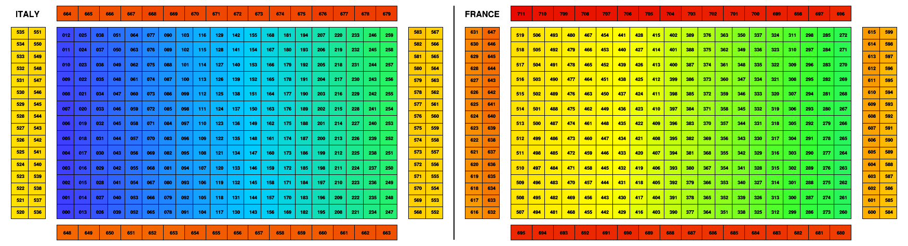

# ROOT


Collection of ROOT scripts and tools


## THlog : ROOT histogramms with logarithmic binning



- TH1Flog  : 1D histogram with log X binning

- TH2Flogx  : 2D histogram with log X binning
- TH2Flogy  : 2D histogram with log Y binning
- TH2Flogxy : 2D histogram with both log X and log Y binning

All exists with float (F) and double (D) version
   
run demo ROOT script :
```	  
root THlog-demo.cc
```


## sndisplay : supernemo calorimeter (and soon tracker ?) display



run demo script :
```	  
root
.L sndisplay.cc
sndisplay_test()
```

There is also the option to draw the fiber mapping.
